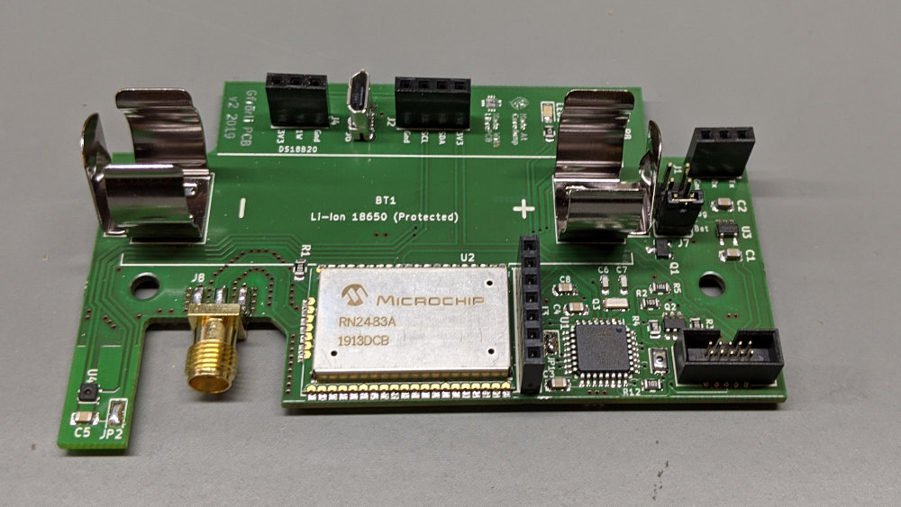

# Gfrörli Sensor Hardware v2

Based on the STM32L071KB microcontroller and the RN2483 LoRaWAN
modem.

Aisler order link for v2.0: https://aisler.net/p/OROZOWMP

This is a [LibrePCB](https://librepcb.org) project!

## Docs

See [`docs/index.md`](./docs/index.md)

## License

No license set.
