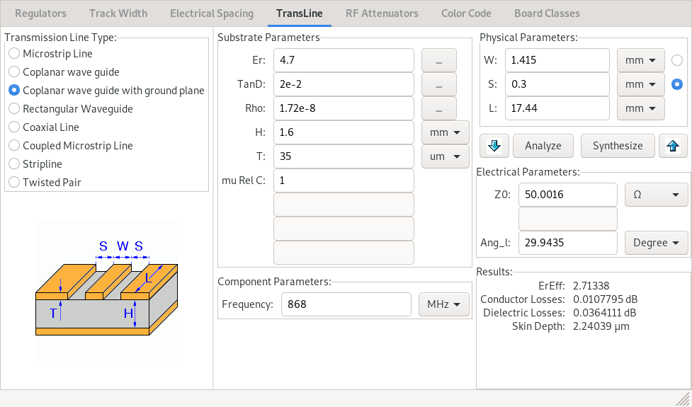

# Antenna / RF

## Trace Calculations

The specs used by Aisler for their standard HASL boards:

- [FR-4-86](https://aisler.net/help/design-rules-and-specifications/specifications/2_layer_datasheet.pdf)
  - Dielectric constant / permittivity @ 1 MHz: Max 5.4 Measured 4.7
  - Loss Tangent @ 1 MHz: Max 0.035 Measured 0.02
- Copper thickness: 35 µm
- Board thickness: 1.6 mm

The current PCB layout uses a coplanar wave guide with ground plane.

With 0.3mm plane clearance:

With a trace width of 1.415 mm we should get an impedance of 50.0016 Ω.

See https://github.com/gfroerli/hardware-v2/issues/30 for more details.

## SMA Connector

We use a 50 Ω edge mount female SMA connector
[CON-SMA-EDGE-S](https://www.digikey.ch/products/en?keywords=%20CON-SMA-EDGE-S)
by RF Solutions. It seems to have the same footprint as the [Samtec
SMA-J-P-H-ST-EM1](https://www.digikey.com/product-detail/en/samtec-inc/SMA-J-P-H-ST-EM1/SAM8857-ND/2602450).
